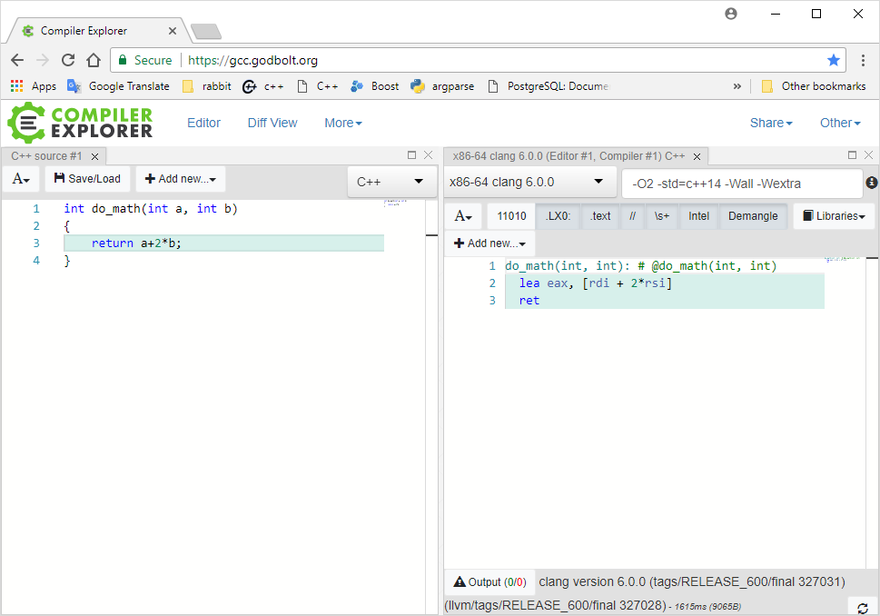

class: center, middle

# Closer Look 
## at Undefined Behaviour and Compiler Optimizations

Maciej Gajewski

---

# About me

* Maciek Gajewski [maciej.gajewski0@gmail.com](mailto:maciej.gajewski0@gmail.com)
* 30 years of programming, 20 years of C++
* 2000-2010 Wrocław (Pruftechnik, Tieto)
* 2010-2018 London, Amsterdam, 
* HFT, teaching (Tibra, Optiver)


.center[

]
---

# Undefined Behavior

### What triggers UB in C++

* Data race (simultaneous read and write)
* Dereferencing null/wild pointer
* Accessing array out of bounds
* Overflowing signed integer
* Using uninitialized value
* Oversized integer shift
* Division by zero

---

# Undefined Behavior
### The popular definition

> “When the compiler encounters [a given undefined construct] it is legal for it to make demons fly out of your nose”

comp.std.c, 1992

.center[

]

???

Completely useless from educational point of view.
Will demons fly out of your nose if you dereference nullptr? If you use uninitialized value?

---
# Undefined Behavior
### More useful definition

* It's a bug in your code!
* Machine-dependent behavior that would be too costly to define
* Something, that compiler can assume you would never do
--

* Magical way in which compiler reads your comments


---
# Undefined Behavior

> The essence of undefined behavior is the freedom to avoid a forced coupling between error checks and unsafe operations. 

> In summary, undefined behavior in programmer-visible abstractions represents an aggressive and dangerous tradeoff: it sacrifices program correctness in favor of performance and compiler simplicity. 

[https://blog.regehr.org/archives/1467]

???
Too long to read during the presentation


---
# Let's have a closer look

* Compiler Explorer: https://godbolt.org
* By Matt Godbolt
* CppCon 2017 _“What Has My Compiler Done for Me Lately?”_


.center[

]

???
Survey the audience: who knows compiler explorer?
Great tool for teachers and tweakers
Basic assembly required

<!-- ======= Data race ========== -->

---
class: center, middle
# Chapter 1
## Data race

---

This code...
```cpp
int x = 1;

void  fun(int c) {
	x = 7;
    x = 666;
    x = 3;

    for(int i = 0; i < c; ++i)
        x = i;
}
```
--
will be compiled as
```cpp
int x = 1;

void  fun(int c) {
	if (c > 0)
        x = c-1;
    else
        x = 3;
}
```

???

When an evaluation of an expression writes to a memory location and another evaluation reads or modifies the same memory location, the expressions are said to conflict. A program that has two conflicting evaluations has a data race, unless:

* both evaluations execute on the same thread or in the same signal handler, or
* both conflicting evaluations are atomic operations (see std::atomic), or
* one of the conflicting evaluations happens-before another (see std::memory_order)

If a data race occurs, the behavior of the program is undefined.

Compiler is allowed to ignore any intermediate state of 'x', as long as the final, observable effect is the same.
What would happen to a hi prio thread observing 'x'? It would not see the expected, intermediate values (7, 666, 0..c)
"Compiler compiles only one thread at a time" (Herb Sutter, "atomic<> weapons")

<!-- ====== Null pointer ======== -->

---
class: center, middle
# Chapter 2
## Null-pointer dereference


---

### If dereferencing nullptr was defined...

If this C++ code...
```cpp
size_t File::read(void* buf, size_t size)
{
	if(bsize == 0) {
		bsize = do_read(buf, bufsize, fd);
	}
	return copy_from_buffer(buf, size);
}
```
would really be this ?
```cpp
size_t File::read(File* this, void* buf, size_t size)
{
	`if (!this) __raise_error();`
	if(this->bsize == 0) {
		`if (!this->vtbl || ! this->vtbl->do_read) __raise_error();`
		this->bsize = (*this->vtbl->do_read)(this, this->buf, this->bufsize, this->fd);
	}
	return copy_from_buffer(this, buf, size);
}
```
--
NO!!!!

???
In the first version of this presentation, I used this slid. It is not true!
Hardware can trap null pointer reference on most architectures, and JRE is using it!

Compiler would be forced to generate code checking for null pointer every time a pointer is accessed.
But compilers are not doing that!

---
But this...
```cpp
class Widget {
	int getSize() const { return 3; }
};

int get_size(Widget& w) {
	return w.getSize();
}
```
--
will be this:
```cpp
int get_size(Widget& w) { return 3; }
```
--
But Java _has_ to do this:
```cpp
int get_size(Widget* w) {
	if (!w) throw NulPointerException();
	return 3; 
}

```

???
Even if getSize is virtual, but compiler is able to de-virtualize it, it can greatly simplify the function.
The 'this' pointer is not usd,. no need to check for it. _Compiler can assume it is not null_.

Java has no such freedom.

---

### Dereferencing nullptr

.pull-left[
This code
```cpp
// Safe to call with nullptr
void fun1(Widget* w) {
	if (w)
		do_smth(w->data);
	else
		report_error();
}

// 'w' can't be null!
void fun2(Widget* w) {
	w->data = get_data();
	fun1(w);
}
```
]
--
.pull-right[
	fun2, after inlining
```cpp
// 'w' can't be null!
void fun2(Widget* w) {
	w->data = get_data();

	if (w)
		do_smth(w->data);
	else
		report_error();
}
```
]

???

first step - inlining
---
### Dereferencing nullptr

.pull-left[
This code
```cpp
// Safe to call with nullptr
void fun1(Widget* w) {
	if (w)
		do_smth(w->data);
	else
		report_error();
}

// 'w' can't be null!
void fun2(Widget* w) {
	w->data = get_data();
	fun1(w);
}
```
]
.pull-right[
	after inlining
```cpp
// 'w' can't be null!
void fun2(Widget* w) {
	w->data = get_data();

	`if (w)`
		do_smth(w->data);
	`else`
		`report_error();`
}
```
]

???

next step - removing null branch
---
### Dereferencing nullptr

.pull-left[
This code
```cpp
// Safe to call with nullptr
void fun1(Widget* w) {
	if (w)
		do_smth(w->data);
	else
		report_error();
}

// 'w' can't be null!
void fun2(Widget* w) {
	w->data = get_data();
	fun(w);
}
```
]
.pull-right[
optimized
```cpp
// 'w' can't be null!
void fun2(Widget* w) {
	w->data = get_data();

	do_smth(w->data);
}
```
]

???

final stage


---

# Nice!
### , but...

.center[
	
]

---
### Actual Kernel code

```c
static unsigned int tun_chr_poll(struct file *file, poll_table * wait)
{
	struct tun_file *tfile = file->private_data;
	struct tun_struct *tun = __tun_get(tfile);
	unsigned int mask = 0;

	if (!tun)
		return POLLERR;
	// ... rest of the code
```

https://lwn.net/Articles/342330/
???
It is C, so variable initializations must be at the beginning

"The TUN/TAP driver provides a virtual network device which performs packet tunneling; it's useful in a number of situations, including virtualization, virtual private networks, and more. "
---
### Actual Kernel code

```c
static unsigned int tun_chr_poll(struct file *file, poll_table * wait)
{
	struct tun_file *tfile = file->private_data;
	struct tun_struct *tun = __tun_get(tfile);
	`struct sock *sk = tun->sk;`
	unsigned int mask = 0;

	if (!tun)
		return POLLERR;
	// ... rest of the code
```
???
The line has been added in the header of the function

---
### Actual Kernel code

```c
static unsigned int tun_chr_poll(struct file *file, poll_table * wait)
{
	struct tun_file *tfile = file->private_data;
	struct tun_struct *tun = __tun_get(tfile);
	`struct sock *sk = tun->sk;`
	unsigned int mask = 0;

	`if (!tun)`
		`return POLLERR;`
	// ... rest of the code
```
???
And suddenly, the if disappears.
Attacker may actually map some malicious code at address 0


<!-- ====== Array ======== -->


---
class: center, middle
# Chapter 3
## Accessing array out of bounds

---
# Very simple example
.pull-left[
This code
```cpp
int fun(int idx, int val) {
	int array[3];
	array[idx] = val;
	return array[idx];
}
```
]
--
.pull-right[
is compiled to
```cpp
int fun(int, int val) {
	return val;
}
```
]

???
Seems like a contrived example, but the code may be a result of 
- inlining, 
- dead-branch remove, 
- compile-time evaluation of constant expressions

---

# Nice!
### , but...

.center[
	
]

---
# A subtle bug
.pull-left[
This code
```cpp
template<typename T, size_t N>
bool is_in_arr(array<T, N> arr, T v)
{
	for(int i = 0; i < N; i++)
		if (arr[i] == v)
			return true;

	return false;
}
```
]
---
# A subtle bug
.pull-left[
This code
```cpp
template<typename T, size_t N>
bool is_in_arr(array<T, N> arr, T v)
{
	for(int i = 0; i < N; i++)
		if (arr[i] == v)
			return true;

	return false;
}

bool is_right_angle(int deg)
{
	array arr = {0, 90, 180, 270};
	return is_in_arr(arr, deg);
}```
]
--
.pull-right[
is compiled to
```asm
is_right_angle(int):
	test edi, edi
	je .L5
	cmp edi, 90
	je .L5
	cmp edi, 180
	je .L5
	cmp edi, 270
	sete al
	ret
.L5:
	mov eax, 1
	ret
```
]
---
# A subtle bug (2)
.pull-left[
This code
```cpp
template<typename T, size_t N>
bool is_in_arr(array<T, N> arr, T v)
{
	for(int i = 0; i `<=` N; i++)
		if (arr[i] == v)
			return true;

	return false;
}

bool is_right_angle(int deg)
{
	array arr = {0, 90, 180, 270};
	return is_in_arr(arr, deg);
}```
]
--
.pull-right[
is compiled to
```asm
is_right_angle(int):
	mov eax, 1
	ret
```
]

---
background-image: url(pics/ubdiagram1.png)
---
background-image: url(pics/ubdiagram2.png)


<!-- --------- Signed integer overflow            -->
---
class: center, middle
# Chapter 4
## Signed integer overflow

---
# Optimization

.pull-left[
This code
```cpp
void zero_arr(float* arr, int off)
{
	for (int i = 0; i != 10000; ++i)
		arr[i+off] = 0.0f;
}
```
]
--
.pull-right[
is compiled to the equivalent of
```cpp
void zero_arr(float* arr, int off)
{
	::memset(arr+off, 0, 40000);
}
```
]

???
Nice, huh? memset probably uses all the vectorization techniques your CPU supports.

---
# Optimization

.pull-left[
This code
```cpp
int sum(size_t count)
{
	int sum = 0;
	for (int i = 0; i < count; i++)
		sum += i;
	return sum;
}
```
]
--
.pull-right[
Clang compiles it to:
```cpp
int sum(size_t count)
{
	return (count * (count+1))/2;
}
```
]
???
Clang is able to work-out the close-form solution

---

# Nice!
### , but...

.center[
	
]

---
# Detecting overflow

```cpp
void zero_arr(float* arr, int off)
{
	if (off + 10000 < off)
		throw overflow_error();
	
	for (int i = 0; i != 10000; ++i)
		arr[i+off] = 0.0f;
}
```
---
# Detecting overflow

```cpp
void zero_arr(float* arr, int off)
{
	`if (off + 10000 < off)`       // this code
		`throw overflow_error();`  // goes away
	
	for (int i = 0; i != 10000; ++i)
		arr[i+off] = 0.0f;
}
```
???
This code goes away!

---
# Detecting overflow

```cpp
void zero_arr(float* arr, int off)
{
	if (off > MAX_INT - 10000)
		throw overflow_error();
	
	for (int i = 0; i != 10000; ++i)
		arr[i+off] = 0.0f;
}
```
<!-- --------- Using undefined value            -->
---
class: center, middle
# Chapter 5
## Use of an uninitialized variable

---
# Optimization

.pull-left[
This code
```cpp
enum side { BUY, SELL };

// s must be 'b' or 's'!
side decode_side(char s)
{
	side r;
	if (s == 'b')
		r = BUY;
	if (s == 's')
		r = SELL;
	return r;
}```
]
--
.pull-right[
Compiles as:
```cpp
enum side { BUY, SELL };

// s must be 'b' or 's'!
side decode_side(char s)
{
	if (s == 'b')
		return BUY;
	else
		return SELL;
}
```
]
???
Passing invalid value will not make the return value random


---
# Garbage in - garbage out


.pull-left[
This code
```cpp
void fun()
{
	int x;
	if (x != 7)
		foo();
	else
		bar();
}```
]
--
.pull-right[
clang:
```asm
fun(): # @fun()
	jmp bar() # TAILCALL
```
]
--
.pull-right[
gcc:
```asm
fun():
	jmp foo()
```
]
???
Garbage in - garbage out
---
# Erasing your HD with UB


.pull-left[
This code
```cpp
static void (*fptr)();

static void erase_hd()
{
	::system("rm -rf /");
}

void set_fptr() { fptr = erase_hd; }

void call_fptr() { fptr(); }
```
]
--
.pull-right[
Clang compiles it to:
```cpp
void set_fptr() { }

void call_fptr()
{
	::system("rm -rf /");
}

```
]
???
GCC generates more faithful code
---
# Erasing your HD with UB


.pull-left[
This code
```cpp
static void (*fptr)() = `nullptr`;

static void erase_hd()
{
	::system("rm -rf /");
}

void set_fptr() { fptr = erase_hd; }

void call_fptr() { fptr(); }
```
]
.pull-right[
Clang compiles it to:

```cpp
void set_fptr() { }

void call_fptr()
{
	::system("rm -rf /");
}

```
]
???
Also a manifestation of dereferencing nullptr

---
# The Last Slide

* Maciej Gajewski <maciej.gajewski0@gmail.com>
* This presentation: https://maciekgajewski.github.io/CloserLookAtUB/
* Compiler Explorer: https://gcc.godbolt.org
* CppCon 2017, _“What Has My Compiler Done for Me Lately?”_, Matt Godbolt
* CppCon 2016, _"Garbage in, Garbage Out"_, Chandler Carruth
* LLVM Project Blog, _"What Every C Programmer Should Know About Undefined Behavior"_
* _"Undefined Behavior != Unsafe Programming"_ https://blog.regehr.org/archives/1467
